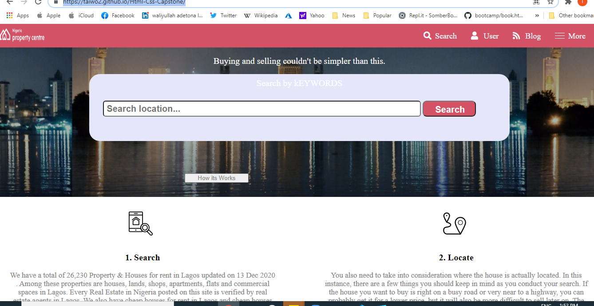

# A project on directory of House Rent.

This is an exact replica of the The Patashule website putting emphasis on how it behaves differently depending on the size of the screen where the website is rendered

Additional description about the project and its features.

## Built With

- HTML5
- CSS3
- Font Awesome icon
- Media Queries

## Live Demo

[Live Demo Link](https://taiwo2.github.io/Html-Css-Capstone/)

# Getting Started 🚀

These instructions will get you a copy of the project up and running on your local machine.

## How To Use 🔧

From your command line, first clone the project:

- ` Clone this repository`
- `git clone https://github.com/taiwo2/Html-Css-Capstone.git`
- `Go into the repository`
- ` cd htmlCapstone`
- `git pull`

## Authors

👤 **Author**

- GitHub: [@Taiwo](https://github.com/taiwo2)
- Twitter: [@TaiwoAdetona4](https://twitter.com/TaiwoAdetona4)
- LinkedIn: [Taiwo Adetona](https://www.linkedin.com/in/taiwo-waliyullahi-adetona-988898180/)

## 🤝 Contributing

Contributions, issues, and feature requests are welcome!

## Show your support

Give a ⭐️ if you like this project!

## Acknowledgments

- Hat tip to anyone whose code was used
- Inspiration
- Design idea by [Mathew Njuguna and others on Behance](https://www.behance.net/mathewnjuguna)
- [Creative Commons license of the design](https://creativecommons.org/licenses/by-nc/4.0)
- [Microverse](https://www.microverse.org/) for their `README` [template](https://github.com/microverseinc/readme-template).

## 📝 License

This project is [MIT](https://opensource.org/licenses/MIT) licensed.

Copyright 2020 Taiwo Adetona
